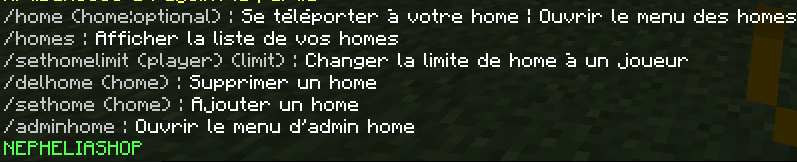
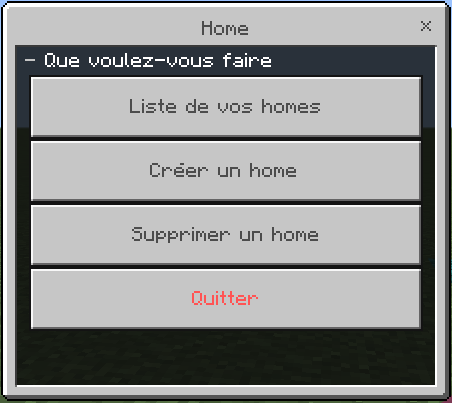
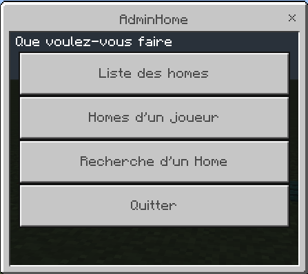

# Home Plugin

## Description
**Home** est un plugin permettant aux joueurs de gérer leurs homes facilement. Ainsi qu'un mode AdminHome pour les administrateurs.

## Fonctionnalités
- **Menu|Commande** : Gérez vos homes avec un menu simple. Utilisez `/home` sans argument pour ouvrir le menu, ou `/home (home)` pour vous téléporter directement.
- **Mode AdminHome** : Les administrateurs peuvent accéder à tous les homes des joueurs, les filtrer par nom, et joueur, et date.
- **Configuration complète** : Toutes les commandes et permissions et messages et forms sont entièrement configurables dans `config.yml`.

## Commandes et Permissions

| Commande        | Description                                  | Usage                            | Permission                    |
|-----------------|----------------------------------------------|----------------------------------|-------------------------------|
| `/home`         | Se téléporter à votre home ou ouvrir le menu | `/home (home:optional)`          | `nephelia.homes.home`         |
| `/homes`        | Afficher la liste de vos homes               | `/homes`                         | `nephelia.homes.homes`        |
| `/sethome`      | Ajouter un home                              | `/sethome (home)`                | `nephelia.homes.sethome`      |
| `/delhome`      | Supprimer un home                            | `/delhome (home)`                | `nephelia.homes.delhome`      |
| `/sethomelimit` | Changer la limite de home d'un joueur        | `/sethomelimit (player) (limit)` | `nephelia.homes.sethomelimit` |
| `/adminhome`    | Accéder au mode AdminHome                    | `/adminhome`                     | `nephelia.homes.adminhome`    |

## Prochaines Fonctionnalités
- Support des bases de données JSON et MySQL.
- Limite de homes configurable par permission.

## Images
- **Commands** : 

- **Menu Joueur** : 

- **Mode Admin** : 

# Support
Pour toute question ou problème, veuillez nous contacter sur [Discord](https://discord.gg/JTcefgZMd3).